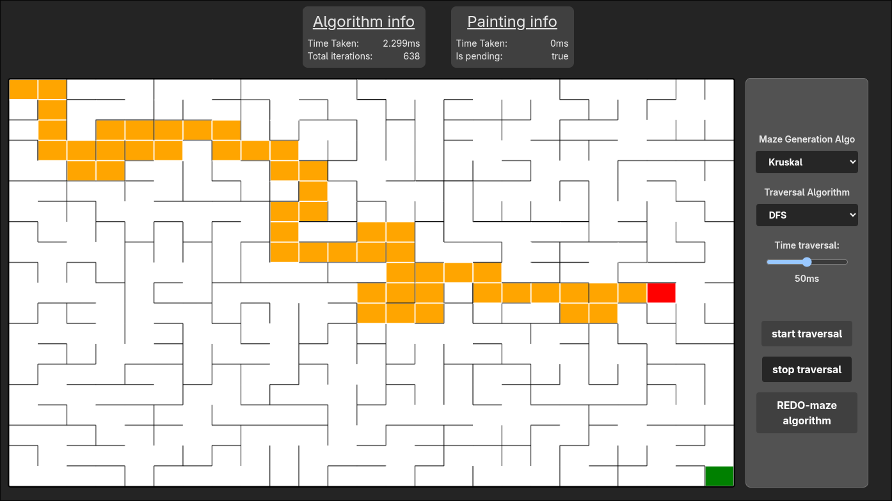

> [!NOTE]  
> Dont get picky with the UI, really. Clearly it wasn't made for it

# algorithm visualizer

i know it has the worst design ever made but my intention was to learn algorithms which, impressively, it worked.

**maze creational algorithms (6):**

- Binary Tree
- Ellers
- Growing Tree
- Kruskal
- Prims
- Recursive backtrack

**maze traversal algorithms (5):**

- A\*
- DeadEnd Fill
- Depth-first search
- Pledge
- Random MOuse (it has the worst performance (it was intended to be like this))

---

### in some future:

Time is tight for me right now. I prefer leaving this project the way it was intended in the beginning

_simple, trivial and small._

maybe in some future i'll be adding more algorithms, or improving small things. i don't really know, i wont promise anything.
either way, i think it meet its goal... to learn algorithms and complex recursion with advanced javascript so im happy :)

> [!TIP]
> I'm open to merge changes.
>
> You can design a better ui, add more algorithms, improve performance or whatever you think is lacking... anything helps
